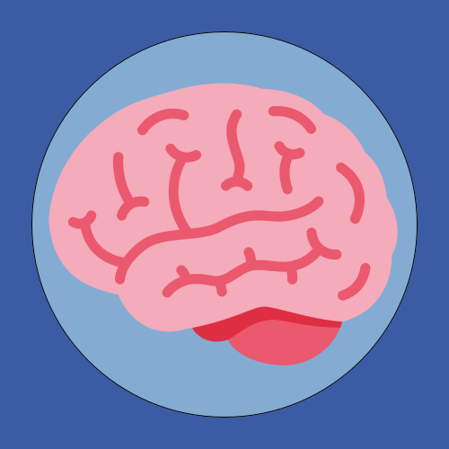

# Brainzen

**Brainzen** is a programming language that compiles to Brainfuck. It has a C-like syntax and lets you perform arithmetic with 8-bit integers.

## About Brainfuck

Brainfuck is an extremely basic programming language created by Urban Müller in 1993. A Brainfuck program consists of a string of characters each representing a command (or a comment). For the list of available commands, see [the Wikipedia article on Brainfuck](https://en.wikipedia.org/wiki/Brainfuck#Commands). Unlike most languages, there is no official specification for Brainfuck. This means behavior may vary slightly between interpreters. Brainzen uses the original interpreter as the definition of Brainfuck, with the exception that the array is expected to be infinitely expandable to the right (which allows for [Turing-completeness](https://en.wikipedia.org/wiki/Turing_completeness)), although it is not required that the pointer is able to access cells to the left of its starting position. It is also important to note (although this is the behavior of the original interpreter) that numbers are expected to be 8-bit integers, and overflows should result in a wrap around.

## Brainzen

### Specification

Brainzen does not have an official specification yet. The current focus is on language design and the underlying implementation of more complex features. The syntax is therefore constantly evolving, with no guarantee of backward compatibility.

### Features

Here is a non-exhaustive list of major available features:

- Subroutines;
- Loops;
- Conditional statements;
- A strict type system with characters, [product types](https://en.wikipedia.org/wiki/Product_type) and type aliases;
- Namespaces.

### Considered features

Here is a list of considered features in arbitrary order (this list is *not* commitment, merely an indication of where the language is heading):

- Strings of arbitrary length;
- Arrays;
- Referencing subroutines before their respective declaration (including recursion);
- In the long run, bigger integers (32-bit, 64-bit);
- In the very long run, floating point numbers ([IEEE 754](https://en.wikipedia.org/wiki/IEEE_754)).

### Turing-completeness

In its current state, Brainzen is *not* Turing-complete. Indeed, any given Brainzen program is a [finite-state machine](https://en.wikipedia.org/wiki/Finite-state_machine) (with a standard output).

#### Proof

For any given Brainzen program, the amount of cells the resulting Brainfuck program uses is bounded. This is because the size of all variables is known at compile time, and every possible execution flow is hard coded (meaning recursion is not possible), so the compiler knows the exact size (and layout) of the memory at any point in the program.

### Code examples

This section contains examples of basic programs and subroutines written in Brainzen. More complex examples are available in this repository, under the [`examples/`](examples) directory.

#### Hello world

```brainzen
func main() {
    println("Hello, World!");
}
```

#### Print numbers in base 10

The following procedure prints the passed number in base 10.

```brainzen
func print10(n: char) {
    let d2 = n / 100;
    let d1 = (n / 10) % 10;
    let d0 = n % 10;
    if (d2) {
        print('0' + d2);
    }
    if (d1 || d2) {
        print('0' + d1);
    }
    print('0' + d0);
}
```

Note that the native `log` procedure does exactly that when passed a `char`.

#### Truth machine

The following Brainzen program implements a [truth machine](https://esolangs.org/wiki/Truth-machine).

```braiznen
func main() {
    let i = input();
    if (i == '0') {
        print('0');
    } else {
        while (1) {
            print(i);
        }
    }
}
```

#### Fibonacci

The following function computes the `n`th number of the [Fibonacci sequence](https://en.wikipedia.org/wiki/Fibonacci_number) iteratively.

```brainzen
func fibonacci(n: char) -> char {
    let a = 0;
    let b = 1;
    loop (n) {
        let c = a + b;
        a = b;
        b = c;
    }
    return b;
}
```

#### [Fizz Buzz](https://en.wikipedia.org/wiki/Fizz_buzz)

```brainzen
func fizzbuzz(n: char) {
    let i = 1;
    loop (n) {
        if (i % 3 == 0 && i % 5 == 0) {
            println("FizzBuzz");
        } else if (i % 3 == 0) {
            println("Fizz");
        } else if (i % 5 == 0) {
            println("Buzz");
        } else {
            log(i);
        }
        i++;
    }
}
```

# Attributions

The brain on the icon is from [Twemoji](https://twemoji.twitter.com/).
